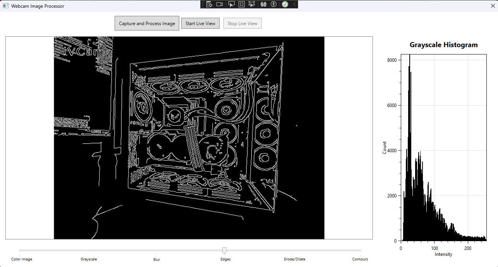
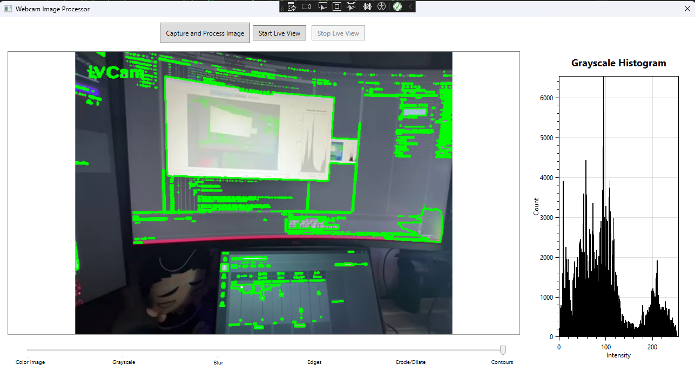

# WPF Webcam Image Processor

## What This Is

Hello! This is a WPF application I built in C# for a coding take-home project. The main goal was to connect to a webcam, grab a picture, do some basic image processing like converting it to grayscale and figuring out its histogram, and then show everything in a simple window.

Along the way, I focused on building it with a clean structure using common patterns like MVVM (Model-View-ViewModel) and Dependency Injection (with Prism/DryIoc) to keep things organized and testable.

## Features

* **Webcam Snapshots:** Grabs pictures from your default webcam using the EmguCV library.
* **Grayscale:** Changes the color picture into a standard 8-bit grayscale image.
* **Histogram:** Calculates how many pixels there are for each brightness level in the grayscale image and shows it in a nice chart using OxyPlot.
* **Filters:** You can apply a few different effects using the slider:
    * See the original color picture.
    * See the grayscale version.
    * Apply a Gaussian blur to smooth things out.
    * Detect edges using the Canny algorithm.
    * Apply an "Opening" effect (erosion then dilation) to clean up small spots.
    * Try to find object outlines (contours) and draw them on the original image.
* **Simple UI:** Shows the processed picture and the histogram side-by-side. Buttons let you capture a new image or try the live view.
* **Live View (Experimental):** There's also a feature to show a live feed from the camera with processing applied in real-time. *Fair warning:* This seemed a bit shaky with my testing setup (using a phone as a webcam), so its stability might depend a lot on your camera and drivers, unfortunately. If I had an extra day I would do more testing, but I ended up spemding the majority of my time reasearching a couple unfamiliat topics.

## Sample Output

Here are a couple of examples showing the application processing an image and applying different filters.

**1. Edge Detection:**


*(Caption: Shows the Canny edge detection result applied to the grayscale version of the captured image. The corresponding histogram for the grayscale image is displayed on the right.)*


**2. Contour Detection:**


*(Caption: Shows the detected contours (green lines) drawn over the original color image. The histogram on the right corresponds to the grayscale version used for detection.)*

---

## Getting Set Up

### What You'll Need

* **IDE:** Visual Studio 2022 is recommended.
* **.NET:** You'll need the .NET 8.0 SDK installed. The project specifically targets `net8.0-windows10.0.17763.0`.
* **OS:** Windows is required because the app uses WPF for the UI.

### Required Libraries (NuGet Packages)

These should get installed automatically when you build the project in Visual Studio, but here's what it uses:

* `Prism.DryIoc`: Handles the MVVM structure, dependency injection, and other nice framework features.
* `Emgu.CV`: A C# wrapper around the powerful OpenCV library, used for all the image processing.
* `Emgu.CV.Bitmap`: Helps convert between EmguCV's image format (`Mat`) and the older `System.Drawing.Bitmap`.
* `Emgu.CV.runtime.windows`: Provides the actual native OpenCV files needed to run on Windows.
* `OxyPlot.Wpf`: A plotting library used to draw the histogram chart.
* `Microsoft.Xaml.Behaviors.Wpf` (Maybe): Prism might pull this in automatically for some UI interaction features.

### How to Install

1.  **Get the Code:** Clone the repository using Git:
    ```bash
    git clone https://github.com/RobotReactor/wpf-webcam-image-processor
    cd wpf-webcam-image-processor
    ```
2.  **Open the Solution:** Launch Visual Studio and open the `.sln` file.
3.  **Let NuGet Do Its Thing:** Visual Studio should automatically download and restore all the required NuGet packages. If it seems like it didn't, just right-click the Solution in the Solution Explorer and choose "Restore NuGet Packages".

## Building and Running

1.  **Startup Project:** Make sure `WpfWebcamImageProcessor.App` is selected as the startup project (it usually is by default). Right-click the project in Solution Explorer and choose "Set as Startup Project" if needed.
2.  **Build Config:** You can typically leave this as `Debug` while developing.
3.  **Build It:** Press `Ctrl+Shift+B` or go to **Build -> Build Solution**.
4.  **Run It:** Press `F5` (for debugging) or `Ctrl+F5` (without debugging) or use the **Debug** menu options.

## How the Code is Organized

The project uses the MVVM (Model-View-ViewModel) pattern to keep the UI (View) separate from the logic (ViewModel) and data (Model). Prism helps manage this.

* **Views (`/Views`):** Contains the user interface definitions written in XAML (`MainWindow.xaml`) and their minimal code-behind (`.xaml.cs`).
* **ViewModels (`/ViewModels`):** Holds the logic that drives the UI. `MainWindowViewModel.cs` handles button clicks, manages the currently displayed image, interacts with services, and holds the state for the main window.
* **Models (`/Models`):** Simple classes representing data, like `ImageProcessingResult.cs` which carries data between services and the ViewModel.
* **Services (`/Services`):** Interfaces and classes that handle specific jobs. This makes the code modular and easier to test.
    * `ICameraService` / `CameraService.cs`: Deals with talking to the webcam (using EmguCV).
    * `IImageProcessingService` / `ImageProcessingService.cs`: Performs the actual image operations like grayscale, blur, edge detection, etc. (using EmguCV).
    * `IHistogramService` / `HistogramService.cs`: Takes care of the OxyPlot chart model used for the histogram.
    * `IImageProcessingWorkflowService` / `ImageProcessingWorkflowService.cs`: Coordinates the steps involved in the single "Capture and Process" action.
* **Converters (`/Converters`):** Small helper classes used in the XAML bindings to convert data types, like the `MatToBitmapSourceConverter` which allows WPF to display EmguCV's `Mat` images.
* **Exceptions (`/Exceptions`):** Defines custom exception types, like `ImageProcessingException`, for more specific error handling.
* **App.xaml / App.xaml.cs:** The starting point of the WPF application. It sets up Prism and registers all the services so they can be automatically injected where needed (Dependency Injection).
* **Tests (`/WpfWebcamImageProcessor.App.Tests`):** A separate project containing unit tests written using MSTest and Moq to verify that the services and ViewModel logic work as expected.

## Decisions & Assumptions Made

* **Windows Focus:** Built using WPF, so it's Windows-only.
* **Default Camera:** The app just uses the default system webcam (index 0). It doesn't include a way to choose between multiple cameras.
* **Internal Image Format:** Decided to use EmguCV's `Mat` object for most internal image handling after the initial capture, as it's more efficient for processing with EmguCV functions. A converter handles showing the `Mat` in the WPF UI.
* **Error Handling:** Basic error handling is in place using exceptions in the services. The ViewModel currently shows errors using a standard `MessageBox`, which isn't ideal for MVVM purity or automated testing – using a dedicated dialog service would be better.
* **Histogram Chart:** Went with OxyPlot after running into some setup issues with other libraries early on. Had to use its `RectangleBarSeries` to get the histogram display working correctly with linear axes.
* **Filter Control:** Used a slider to select the active filter type. The actual parameters for filters (like blur amount) use fixed default values for simplicity.
* **Contours:** The contour detection uses a basic approach (thresholding grayscale). For more complex images, feeding the Canny edge detection output into the contour finder might give better results.
* **Live View:** Implemented as a stretch goal. However, it crashed frequently with my phone-as-webcam setup, likely due to virtual driver instability. It needs testing with standard USB webcams to confirm stability.

## Testing Approach

* **Unit Tests:** Focused on testing the core logic without needing the UI or real hardware.
    * `ImageProcessingService`: Has tests covering all the main functions (grayscale, histogram, blur, erode, dilate, canny, contours, draw contours). These check for correct outputs on valid inputs and ensure appropriate exceptions are thrown for invalid inputs (using MSTest).
    * `MainWindowViewModel`: Has tests covering the command logic (single capture, start/stop live view) and how the ViewModel's state changes in response to actions or simulated service results. Uses the Moq library to create "mock" versions of the services, isolating the ViewModel for testing.
* **How Services Were Tested:**
    * `ImageProcessingService`: Tested directly by creating an instance and feeding it test `Mat` objects.
    * `ImageProcessingWorkflowService`: Would be tested by creating an instance and providing it with *mocked* `ICameraService` and `IImageProcessingService` instances to control what happens during the simulated workflow. (Tests not included in final set for brevity).
    * `HistogramService`: Would be tested by creating an instance, calling its methods with test data, and asserting the state of its `HistogramPlotModel`. (Tests not included for brevity).
    * `CameraService`: Testing code that directly interacts with hardware like this is tricky for *unit* tests. The approach here is to test components that *use* it by providing a *mock* `ICameraService`. Validating the actual `CameraService` fully would require integration tests with real camera hardware, which was challenging due to the instability encountered with the available virtual webcam driver during live streaming tests.
* **UI Testing:** The UI (XAML Views) was not unit tested, which is typical for MVVM. Manual testing was performed. Automated UI testing is possible but was outside the scope of this project.

## Known Issues & Potential Improvements

* **Live View Stability:** As mentioned, the live view might crash (often with an `AccessViolationException`) depending on the camera and driver, especially with virtual webcams.
* **Error Display:** Using `MessageBox.Show` directly from the ViewModel isn't ideal. It should be replaced with Prism's `IDialogService` or a similar mechanism, but again I am running out of limited time :) This is definitely on the TODO list.
* **Logging:** Currently uses `Console.WriteLine` for basic progress/error messages. A more robust logging framework (like Serilog, NLog) should be integrated.
* **Camera Choice:** Doesn't allow selecting which camera to use if multiple are connected.
* **Filter Parameters:** Filters use hardcoded default values. Adding UI controls (like sliders that appear contextually) to adjust these parameters would be a good enhancement.
* **Performance:** For live view, constantly converting `Mat` to `BitmapSource` via `Bitmap` might not be the absolute fastest way. I am going to spend a bit more time on this and make sure the optimization is in the forefront. Unfamiliar territory + time crunch != fantastic performance
